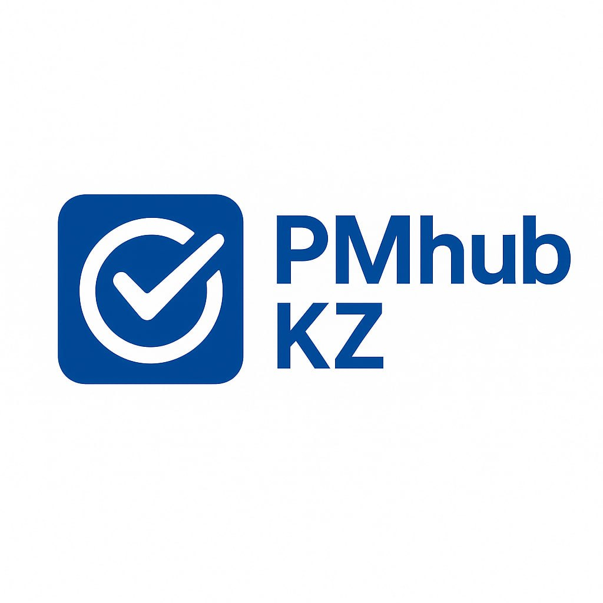

<html lang="en">
<head>
  <meta charset="UTF-8" />
  <meta name="viewport" content="width=device-width, initial-scale=1.0"/>
  <title>PMHub KZ - Learn Project Management</title>
  <link href="https://fonts.googleapis.com/css2?family=Inter:wght@400;700&display=swap" rel="stylesheet">
  
</head>
<body>

  <header>
    
    <h1>PMHub KZ</h1>
    <nav>
      <a href="#about">About</a>
      <a href="#features">Features</a>
      <a href="#contact">Contact</a>
    </nav>
  </header>

  <section class="hero">
    <h1>Learn Project Management Anytime, Anywhere</h1>
    
PMHub KZ is a mobile-first platform that helps students and SMEs in Kazakhstan master project management through localized content and real cases.

  </section>

  <section class="section" id="about">
    <h2>About the Project</h2>
    
Our goal is to make project management accessible and practical for everyone, especially in the SME sector of Kazakhstan. PMHub KZ combines mobile learning, real-world scenarios, and community support to help users gain real project management experience.

  </section>

  <section class="section" id="features">
    <h2>Features</h2>
    

      

        <h3>📱 Mobile Learning</h3>
        
Study on-the-go with our mobile app, complete tasks, and earn certification-ready skills.

      

      

        <h3>🤖 Telegram Chatbot</h3>
        
Use our bot for daily PM tips, updates, resources, and micro-lessons right inside Telegram.

      

      

        <h3>🌐 Community</h3>
        
Join like-minded learners and mentors to grow your network and exchange knowledge.

      

      

        <h3>📂 Templates & Tools</h3>
        
Access practical project templates, checklists, and toolkits designed for SMEs in Kazakhstan.

      

    

  </section>

  <section class="section" id="contact">
    <h2>Contact Us</h2>
    
Have questions or want to partner with us?

    
Email: <a href="mailto:pmhubkz@gmail.com">pmhubkz@gmail.com</a>

    
Telegram: <a href="https://t.me/PMHubKZ_bot">@PMHubKZ_bot</a>

  </section>

  <footer>
    
&copy; 2025 PMHub KZ. All rights reserved.

  </footer>

</body>
</html>
